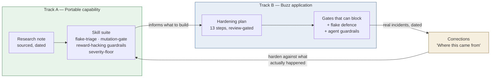
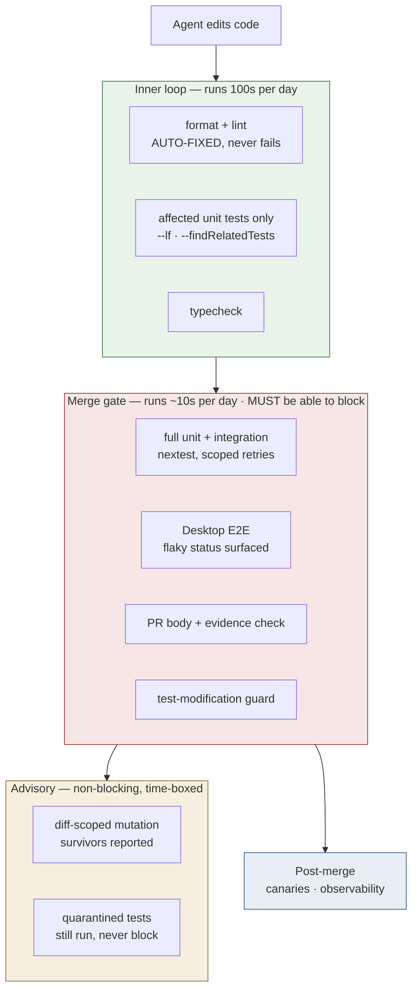
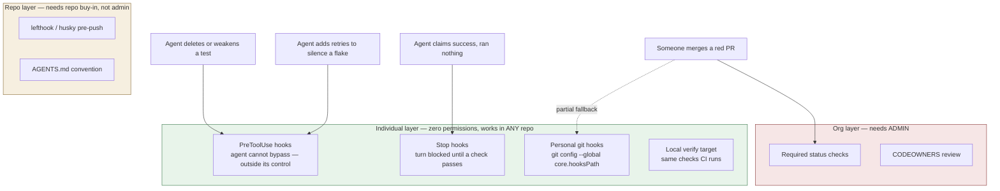
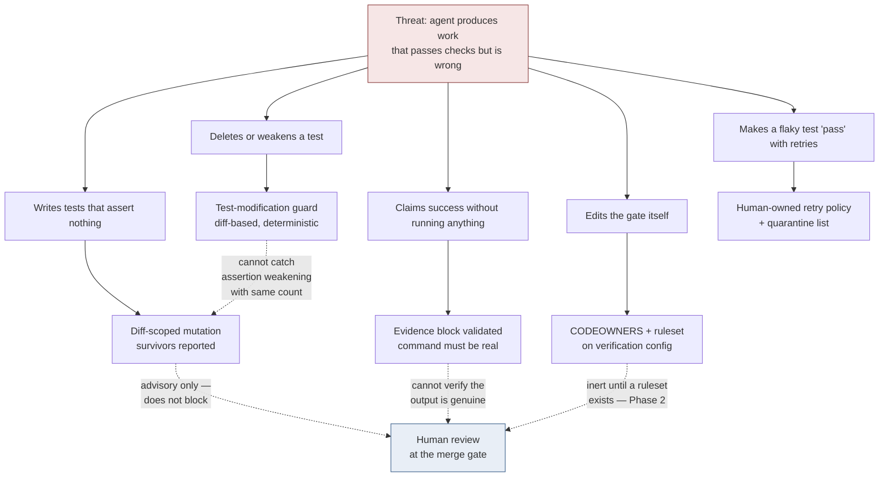
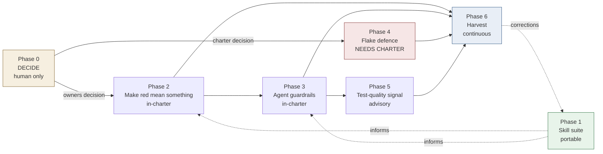

# Test Automation & Verification Programme

**Status:** planning · **Written:** 2026-09-03 · **Owner:** Serina
**Companion plan:** `launchpad/plans/2026-09-03-verification-hardening.md` (revision 3, review-gated twice)
**Research base:** `~/research/test-automation-for-agentic-coding.md` (sourced, primaries verified 2026-09-03)

> **Branch note.** This file and its companion plan are untracked and were written while
> `fix/1996-file-size-check-wrong-base` was checked out. They belong on their **own branch off
> `launchpad`**, not on that fix branch.

---

## Summary

### For a human

Buzz's checks feel broken. The evidence says something more specific, and more fixable:

1. **The code tests are mostly fine.** `ci.yml` failed 4 of its last 100 runs. All four were
   documentation-only PRs failing **Desktop browser tests** — a flake signature, not a code defect.
2. **The noise is in the process checks.** The PR body check failed 9 of 25 runs; the issue body
   check 5 of 7. A gate that is usually red teaches everyone to ignore red.
3. **No check can actually block a merge.** The fork has zero branch protection, zero rulesets and
   zero required status checks. Every red ✗ so far has been advisory. This is the single highest-value
   fix in the programme.
4. **The one CODEOWNERS entry is inert** — GitHub's own validator reports `Unknown owner` for
   `@block/buzz-oss-team` on this fork.
5. **Trivia should never fail a gate.** Formatting auto-fix already exists and works. What is missing
   is the *policy*: an agent that finds a typo fixes it in place; gates fail only for behaviour,
   security, or verification integrity.
6. **Two things are being built, not one.** A *portable skill suite* (works in any repo) and a
   *Buzz application* of it. They ship in separate phases; the Buzz work is what makes the skills
   real rather than theoretical.

**What this programme does not claim.** Not foolproof. Every layer here can miss something. The design
is layers whose blind spots do not overlap, plus failures that say what to do next. Where a layer
cannot catch something, this document names it.

### For an agent picking this up

```
ROLE            You are executing one phase of a multi-phase programme.
READ FIRST      launchpad/plans/2026-09-03-verification-hardening.md   ← the step-level plan
                ~/research/test-automation-for-agentic-coding.md       ← why each mechanism exists
BUILD WITH      serina:build-change  (one step at a time, each step's own done-when)
GATES           review-plan before building · review-code + review-tests per step
                review-final before merge · qa explore mode applies
BLOCKED-ON      Phase 0 decisions are HUMAN decisions. Do not resolve them yourself.
                They are OPEN (e), (f), (g) in the hardening plan.
NEVER           add retries, sleeps or timeout bumps to make a failing test pass
                weaken or delete a test without a `test-change:` declaration in the PR body
                edit .config/nextest.toml, quarantine.toml, lefthook.yml or workflows
                  without flagging it for human review
ALWAYS          show command output as evidence, never assert success
                fix trivia in place; report only behaviour/security/verification defects
```

---

## Two tracks, one feedback loop

The most common way this programme could go wrong is treating it as one thing. It is two, and the
value flows in a specific direction: the skill suite does **not** depend on Buzz being fixed, but the
skills only become *good* by being tested against Buzz's real failures.



**Read the loop, not the boxes.** Skills written from research alone drift. Skills carrying a dated
incident stick — which is exactly how `plan-change` is written, with its own "Where this came from"
section. Track B is the incident generator for Track A.

---

## The verification ladder

The governing rule for efficiency: **the more often a check runs, the cheaper it must be.** Agents
iterate hundreds of times where a human iterates ten, so *where* a check sits matters more than which
tool implements it.



| Placement rule | Consequence when broken |
|---|---|
| Trivia is auto-fixed in the inner loop | Gates go red for formatting; red stops meaning anything |
| Only the merge gate blocks | Slow checks tax every agent iteration |
| Expensive checks are diff-scoped and advisory | Mutation runs blow the budget and get disabled wholesale |
| Flaky ≠ failed, as a distinct reported state | Agents "fix" flakes by adding retries, corrupting the suite |

---

## Enforcement layers — admin is the weakest link, not the strongest

**Design principle, decided 2026-09-03:** the individual layer is **primary**; repo and org
enforcement are **optional upgrades**, detected and used where available.

This came from asking the right question — *"there will be times you're working on someone else's
project and won't have admin, but you still want the skill"*. That is the common case, not the edge
case. A verification system that only works where you hold admin is a system you cannot take with you.

### Two threat models, often confused

| | Threat | Enforced by | Needs admin? |
|---|---|---|---|
| **Organisational** | *anyone* merges something bad | required status checks, CODEOWNERS review | ✅ yes |
| **Individual** | *my own agent* games my tests, or I push something broken | harness hooks, git hooks, local gates | ❌ **no** |

**The reward-hacking problem lives entirely in row two.** The research's documented failure modes —
agents deleting tests, adding retries to silence flakes, asserting success without running anything —
are all threats from *your own* agent. None of them need org-level permission to prevent.



Note what the diagram shows: **three of the four agent threats are fully covered without admin.** Only
"someone merges a red PR" genuinely requires org-level enforcement — and that is the one threat that
is not about agents at all.

### The ladder, strongest first

| # | Layer | Bypassable by | Portable to any repo? |
|---|---|---|---|
| 1 | **Claude Code PreToolUse hooks** | nothing the agent controls | ✅ |
| 2 | **Stop hooks** — block the turn until a check passes | nothing the agent controls | ✅ |
| 3 | **Personal git hooks** via `core.hooksPath` | `--no-verify` (a deliberate act) | ✅ |
| 4 | **Local verify target** (`just verify`, Makefile) | not running it — so pair with 1 | ✅ |
| 5 | **Repo hooks** (`lefthook.yml`) | `--no-verify`; needs repo buy-in | ⚠️ per-repo |
| 6 | **Protection on your own fork** — you *are* admin of your fork | — | ⚠️ fork workflow only |
| 7 | **Upstream branch protection** | — | ❌ needs admin |

### This is already proven in-house

Serina's existing global hooks are a working instance of layers 1–2, predating this programme:

- **`verify-gate.sh`** — PreToolUse on Bash: blocks `git commit` unless a **fresh verification stamp**
  exists. The stamp is written by a passing test run and **cleared by any edit**, forcing
  re-verification. That is evidence-required completion, enforced where the agent cannot argue with it,
  in every repo she clones.
- **`git-safety.sh`** — blocks destructive git operations.
- **`pr-gate.sh`** — refuses `cd <dir> && gh pr create/merge` shapes.

Both files also carry their own dated defect notes — `verify-gate.sh`'s trigger was once
`git\s+commit\b`, which `git -C /path commit` walked straight past; a guard narrower than the thing it
guards. **That is the pattern to copy: the guard, and the written record of how it failed.**

**Unused headroom:** `git config --global core.hooksPath` is currently unset, so layer 3 is available
and not yet in use.

## Defence in depth — and the honest gaps

No single layer is sufficient. What makes this a system rather than a pile is that each layer's blind
spot is covered by a different layer. Where nothing covers it, this says so.



**Named blind spots** — these are design limits, not oversights:

| Layer | Cannot catch | Covered by |
|---|---|---|
| Test-modification guard | assertion *weakening* with unchanged count (`assert_eq!(a,a)`) | mutation layer (advisory) |
| Mutation testing | anything outside the diff; and it does not block | human review; periodic audit |
| Evidence block | pasted output that was never actually produced | human review; CI re-runs the same command |
| Flake quarantine | a genuine bug misfiled as a flake | every entry carries an issue number, so it stays visible |
| All of it | a wrong requirement correctly implemented | `qa` premortem; product review |

---

## Phases

Each phase is independently deployable and independently valuable. Phases 1–3 need no cohort
decision. Phase 4 does.



Note Phase 1 runs **beside** everything — it is never a blocker, and Phase 6 feeds back into it.

---

### Phase 0 — Decide (human, no code)

Three decisions no agent may make. Everything else waits on two of them.

> **A decision with no owner is a fail-open default** — whoever reaches it first interprets it, which
> is the exact defect class this programme exists to remove. Ben raised this on 2026-09-03 and he is
> right: an unowned Phase 0 is the weakest link in the whole document. **Fill the two columns below
> before starting Phase 2.** They are deliberately left blank rather than guessed at.

**Access facts, verified 2026-09-03 via the GitHub API — these constrain what is even possible:**

| Fact | Value | Source |
|---|---|---|
| Repo | `launchpad-26/buzz`, a public **fork of `block/buzz`** | `gh api repos/launchpad-26/buzz` |
| Owner | organisation `launchpad-26` — **not an individual** | same |
| Serina's repo permission | `maintain: true`, **`admin: false`** | same |
| Serina's org role | `member` | `gh api orgs/launchpad-26/memberships/…` |
| Who may manage rulesets / branch protection | **Admin only.** GitHub's role table marks Maintain ✗ for "Manage branch protection rules and repository rulesets" | [GitHub docs — repository roles](https://docs.github.com/en/organizations/managing-user-access-to-your-organizations-repositories/managing-repository-roles/repository-roles-for-an-organization) |

**Consequence: step 7(a) cannot be performed by Serina.** Enabling a ruleset needs someone with admin
on `launchpad-26/buzz`. This is a fact about access, not a disagreement about design.

| # | Decision | Owner | Decide by | Why it cannot be delegated | Blocks |
|---|---|---|---|---|---|
| **(h)** *new* | Does anyone in the cohort have admin on the fork, and will they enable a ruleset? | **Jeff — `tucktuck101`** | ⬜ | Requires admin; nobody else can answer whether we hold it | Phase 2 step 7 · gates everything below |
| **(f)** | Fork charter: may we modify upstream files? | **Group discussion** | ⬜ | Not a technical call — a relationship-with-upstream call on a repo the cohort does not own. Buzz's guide says *"We operate Buzz; we do not develop it."* Phase 4 touches `ci.yml`, `.config/nextest.toml`, `desktop/playwright.config.ts` | Phase 4 |
| **(g)** | Who are the valid CODEOWNERS on the fork? | **Group discussion** | ⬜ | The current team owner is invalid here; picking humans is governance. **Moot unless (h) is yes** — CODEOWNERS without admin-set enforcement is decorative | Phase 2 step 7 |
| **(e)** | Should docs-only diffs run Desktop E2E? | **Group discussion** | ⬜ | Would have prevented **all four** observed CI breaks — but it edits an upstream file, so it inherits (f) | Phase 4 scope |

**Escalation rule.** If (f) has no answer by the time Phase 2 completes, do **not** let a builder infer
it. Default to the narrowest option — stay inside `launchpad/` — record that as the decision with its
date, and reopen it later. A recorded narrow decision beats an unrecorded broad one.

### Contingency — if (h) is "no admin"

The programme does **not** die; its enforcement layer moves to what the cohort actually controls.
Ranked by strength:

| Layer | Controlled by | Still available without admin? |
|---|---|---|
| **`lefthook` pre-push** — blocks locally *before* a PR exists | the repo, already installed by `just setup` | ✅ **yes — this becomes the primary gate** |
| **Harness-level PR hook** — Serina's existing `pr-gate.sh` already refuses certain `gh pr create/merge` shapes | her own `~/.claude` config | ✅ yes, for her agents |
| **`AGENTS.md` / `CLAUDE.md` convention** — agents instructed never to merge on red | the repo | ✅ yes, but advisory |
| **CI status visible on the PR** — red is legible, just not blocking | GitHub, default | ✅ yes |
| **Required status checks / code-owner review** | admin only | ❌ **no** |

**What changes if enforcement is convention-only:** "red must block" becomes "red must be
*impossible to miss*". That raises the value of Phase 2 steps 1–2 — a body check that fails 9 times
in 25 is noise nobody reads, and noise is fatal when legibility is the only enforcement you have.
It also makes the **advisory-then-evidence** strategy the whole strategy rather than a stepping stone.

**Honest limit:** without admin, nothing stops a human or an agent from merging a red PR. That risk
cannot be engineered away at the repo layer — it has to be named and accepted, or escalated to
whoever holds admin.

**But note how narrow that limit is.** See *Enforcement layers* above: of the four ways this can go
wrong, **only** "someone merges a red PR" needs admin. Every agent-side threat — deleted tests,
retry-spam, unearned success claims — is fully addressable at the individual layer, in this repo,
today, with no permission from anyone. A "no" from (h) costs the programme one row of the table,
not the programme.

**Options for (f)**, since it is the consequential one:

- **Contribute upstream** — cleanest long-term, slowest, needs `block/buzz` review
- **Documented divergence** — fast, creates sync conflicts, needs an ADR
- **Stay in `launchpad/` only** — zero conflict, weaker flake defence (the Desktop E2E flakes stay)

**Exit criteria:** all three recorded in `launchpad/decisions/` as an ADR.

---

### Phase 1 — Skill suite skeleton (portable, parallel)

Builds capability that works in **any** repo. Independent of Buzz entirely.

| Ships | Extends or new | Scope |
|---|---|---|
| `flake-triage` | new | Classify a red run: flake vs real vs infra; quarantine with an issue, never a retry |
| `mutation-gate` | new | Diff-scoped mutation as a *test-quality* check; read survivors, decide gate vs advisory |
| `verification-ladder` | new | Design which check runs in which loop for a given repo; the Phase-0-style audit |
| `severity-floor` | new, small | What an agent fixes in place vs what it reports |
| `review-tests` | **extend** | Add the coverage-theatre patterns the research names: weak oracles, tautologies |
| `qa` | **extend** | Add flake-hunting to explore mode |

**Entry:** none. **Exit:** each skill has a `SKILL.md`, a trigger description, and a "Where this came
from" section (empty until Phase 6 fills it with real incidents) — **plus** the portability criterion
below.

**Deliberately not built:** an LLM-eval skill (that is for testing AI *products*, not for agents
testing code), a contract-testing skill, a custom-report-format skill. See *Bloat*, below.

#### Distribution — DECIDED 2026-09-03 (Serina)

**Three decisions, all settled:**

**(1) A separate plugin, not folded into `serina`.** Verification is a separable concern. A team with
its own planning conventions should be able to adopt verification without inheriting
`plan-change`/`review-*`, and vice versa.

**(2) Build your own — the published one is a reference, not the distribution.** The advice to anyone
adopting this is: *create your own marketplace at the individual level.* Not a fork you forget to
update — your own, that you own.

**(3) The reference lives in a NEW topic-named repo, Serina-owned — not in `serina-skills`.**
Working name `agentic-verification`; ⬜ name still provisional. Rationale:

| | |
|---|---|
| **Identity** | `serina-skills` describes itself as *"Serina McFall's working skills"* — correct for that repo, wrong for something built to be adopted. A topic name says *project*, not *personal kit* |
| **Trust** | This plugin ships hooks that block tool calls. A dedicated, auditable repo is a fairer thing to ask someone to install than an entry inside a personal collection |
| **Versioning** | Releases on its own cadence, unentangled from the `serina` plugin's |
| **Focus** | Adopters install one thing that does one thing |
| **Ownership preserved** | Still Serina's. Donating to an org later stays possible; that door only opens one way |

**Consequence for Phase 1:** creating and publishing the repo is now a task in this phase, not an
afterthought — repo, `.claude-plugin/marketplace.json`, plugin scaffold, then the skills and hooks.

> **A marketplace is 1:1 with a repo.** `known_marketplaces.json` maps each marketplace name straight
> to a GitHub repo, so "your own marketplace" means "your own repo" — not another entry in someone
> else's `marketplace.json`.

**Why individual ownership is the recommended path, not just a permitted one:**

| Reason | Detail |
|---|---|
| **Hooks run shell on your machine** | This plugin ships PreToolUse and Stop hooks that block tool calls. That is a far bigger trust ask than markdown. You should own the code that can block your own commits |
| **Update control** | Nothing changes in your agents' behaviour because someone else pushed a commit |
| **Customisation is expected** | Your severity floor, your quarantine policy, your stack. Config covers most of it; ownership covers the rest |
| **No support dependency** | This reference is offered as-is. One person, no support promised — build on it, don't depend on it |
| **Attribution stays clean** | Credit the source, own the copy |

#### How to build your own — verified structure

Copied from the working layout of `serina-mcfall/serina-skills`, not invented:

```
your-repo/
├── .claude-plugin/
│   └── marketplace.json          ← makes the repo a marketplace
└── plugins/
    └── <plugin-name>/
        ├── .claude-plugin/
        │   └── plugin.json       ← name, version, description, author
        ├── skills/
        │   └── <skill-name>/SKILL.md
        ├── agents/               ← optional subagents
        └── hooks/                ← the enforcement layer
```

`marketplace.json` declares plugins as an array, so one repo can host several:

```jsonc
{
  "$schema": "https://anthropic.com/claude-code/marketplace.schema.json",
  "name": "<your-marketplace>",
  "description": "…",
  "owner": { "name": "…", "email": "…" },
  "plugins": [
    {
      "name": "<plugin-name>",
      "description": "…",
      "source": "./plugins/<plugin-name>",
      "category": "development"
    }
  ]
}
```

Install it with `/plugin marketplace add <you>/<your-repo>`.

**Vet before you adopt.** Anything shipping hooks deserves an audit — read what each hook blocks and
when. The `vet-skill` skill in the reference marketplace exists for exactly this, and applies to its
own author's work as much as anyone's.

#### The plugin ships HOOKS, not only skills — DECIDED 2026-09-03

Per *Enforcement layers* above: the individual layer is primary, so the plugin's enforcement must
install with it. Skills alone are advice; hooks are enforcement.

| Ships | Kind | Why it must be a hook rather than a skill |
|---|---|---|
| test-file write guard | PreToolUse | An agent asked not to edit tests can still edit tests. A hook cannot be reasoned with |
| `--no-verify` / force-push guard | PreToolUse | Bypass attempts are exactly what needs blocking |
| evidence-before-done gate | Stop | The agent must not end its turn claiming success without a passing run |
| flake-triage · quarantine · mutation-reading | Skills | These need judgment, so they belong in skills |

**Precedent to build on, not duplicate:** `verify-gate.sh`, `git-safety.sh` and `pr-gate.sh` already
exist globally. The plugin's hooks must **detect and defer** to an existing installation rather than
double-gate — two hooks blocking the same command produce confusing failures.

**This makes the suite portable by construction.** Install the plugin, clone any repo — a client's,
someone else's open source, a fork you have no rights on — and enforcement is live on day one with no
permissions requested from anyone.

#### The `init` skill's real job

Not "write a config file" but **detect the strongest enforcement available here and configure it,
degrading gracefully**:

```
admin on the repo?        → offer required checks + CODEOWNERS   (best)
repo hooks welcome?       → lefthook/husky entries               (good)
neither?                  → personal hooks + core.hooksPath      (still works)
always                    → PreToolUse/Stop hooks from the plugin
```

A verification system that refuses to run without admin is a verification system nobody can take to
their next project.

#### Adaptability — reach for these in order

| Tier | Mechanism | Covers |
|---|---|---|
| 1 | **Detect, don't ask** — read the repo and adapt: `Cargo.toml` → nextest, `package.json` → vitest/jest, `.github/workflows/` → Actions | the large majority |
| 2 | **Repo-local config** — a small optional `.verification.toml` for what cannot be detected: which branch is protected, what counts as trivia, where the quarantine list lives | the rest |
| 3 | **An `init` skill** — interviews once, writes the config, adds a `CLAUDE.md` section | turns *installable* into *adoptable* |

The precedent is already in-house: `plan-change` says *"use the base directory announced for this
skill, not a hard-coded path."* Same discipline, applied to stacks instead of paths.

#### Portability criterion — a hard exit gate for this phase

**No skill in the plugin may reference Buzz, `launchpad`, `pr_body_check.py`, cohort process, or any
repo-specific path.** The skill keeps the *reasoning* — "quarantine is human-owned and every entry
carries an issue number" — and detects the *mechanism*. Everything Buzz-shaped stays in the hardening
plan, which is Track B.

Check it mechanically before publishing — **fail-closed**, so a missing or misnamed directory is a
failure rather than a silent pass:

```bash
#!/usr/bin/env bash
# run from the root of the topic repo (working name: agentic-verification)
dir="${1:?usage: check-portability.sh <plugin-dir>}"
test -d "$dir" || { echo "FAIL: $dir does not exist — nothing was checked"; exit 1; }
if grep -rniE 'buzz|launchpad|pr_body_check|cohort|nextest 0\.9\.136' "$dir"; then
  echo "FAIL: repo-specific references found above"; exit 1
fi
echo "PASS: no repo-specific references in $dir"
```

> **Why the guard exists.** The first version of this check was a bare `grep` with the comment "must
> return nothing." Serina ran it on 2026-09-03 before the directory existed: it printed nothing and
> exited quietly — identical to a clean pass. A check whose input is missing must report that, never
> succeed. This is the same fail-open defect the programme's own gates are designed to prevent, found
> in the programme's own verification command.

#### Open sub-decisions for this phase

- ⬜ **Canonical copy direction.** Home `~/.claude/skills/` → plugin → any adopter's own copy is three
  copies of one instruction. `research`'s own note warns: *"Two copies of one instruction drift apart
  quietly."* Decide the canonical direction **before** the third copy exists, not after. This matters
  more now that adopters are advised to build their own — a reference that drifts from its author's
  working copy teaches the wrong thing.
- ✅ **Which repo hosts the reference** — DECIDED 2026-09-03: a new topic-named repo, Serina-owned.
  See decision (3) above.
- ⬜ **The name itself** — `agentic-verification` is a working title. Last provisional item; changing
  it later costs a repo rename and a re-`add` for anyone who installed early, so worth settling
  before publishing rather than after.

---

### Phase 2 — Make red mean something (in-charter, highest value)

This is where the pain actually is. All surfaces are `launchpad/` or `.github/workflows/launchpad-*`
— in-charter for the fork, no upstream divergence.

| Plan step | Ships | Verified problem it fixes |
|---|---|---|
| 1 | Failure triage + replay corpus | 9/25 and 5/7 failure rates, cause unknown |
| 2 | Fix the dominant failure class; every failure names its rule | Agents iterate blind against vague failures |
| 7 | **Branch ruleset + required status checks + valid CODEOWNERS** | Nothing can block a merge today |
| 12 | Severity-floor policy | Trivia reported instead of fixed |
| 13 | Verification-ladder docs in `TESTING.md` + `launchpad/AGENTS.md` | No written policy for agents to follow |

**Entry:** Phase 0 decision (g). **Exit:**
`gh api repos/launchpad-26/buzz/codeowners/errors` returns zero errors; a PR failing a required check
cannot be merged; body-check failure rate under 10% on a week of runs.

> ⚠ **Rollout risk.** Enabling a ruleset on a busy branch mid-fleet can block in-flight agent PRs.
> Schedule it, announce it in the worklog, keep "disable ruleset" ready as rollback.

---

### Phase 3 — Agent guardrails (in-charter)

| Plan step | Ships | Notes |
|---|---|---|
| 8 | Test-modification guard | Covers `#[test]`, `#[tokio::test]`, `#[rstest]`, `proptest!`, deleted test files, `.spec.ts`. States its own blind spot |
| 9 | **Tighten** the existing evidence check | Today any fence anywhere passes — including an empty one. Do not add a parallel section; the template forbids new headings |

**Entry:** Phase 2 step 2 (same files). **Exit:** fixture diffs prove each guard fails without a
declaration and passes with one; an empty-fence PR body fails.

---

### Phase 4 — Flake defence (blocked on charter decision)

Aimed where the flakes verifiably are: **Desktop Playwright E2E**, not Rust.

| Plan step | Ships | Already exists — do not rebuild |
|---|---|---|
| 3 | `.config/nextest.toml` with retries **scoped away from every shared-Postgres lane** | — |
| 4 | `ci.yml` wired to profiles; JUnit artifacts; flaky summary | — |
| 5 | Playwright JUnit reporter + flaky surfacing + trace upload | `retries: CI ? 2 : 0` and `trace: on-first-retry` **already exist** |
| 6 | One human-owned `quarantine.toml` generating exclusions for both runners | — |

**Entry:** Phase 0 decision (f) — steps 3, 4 and 5 all edit upstream files.
**Exit:** a forced-flaky test reports as *flaky* with a trace artifact, not as passed; quarantining a
test removes it from the gating job and keeps it running in a non-gating one.

> **Verify before building:** the pinned nextest 0.9.136's support for profiles, per-override retries
> and flaky status was *not* confirmed at plan time. Read the docs first; bump the pin if needed.

---

### Phase 5 — Test-quality signal (advisory first)

| Plan step | Ships |
|---|---|
| 10 | `cargo mutants --in-diff` on PRs touching `crates/**`, time-boxed, non-required |
| 11 | Baseline across ~10 merged PRs → ADR recommending gate / advisory / label-triggered |

**Entry:** Phase 3. **Exit:** the ADR carries a per-PR table of survivors, noise and wall-clock, plus
a threshold recommendation. **Budget risk:** mutation on a large Rust workspace can blow any time-box;
fallback is label-triggered rather than per-PR.

> **Verify before building:** `--in-diff` input semantics (diff file vs content, path relativity in a
> workspace) were not confirmed at plan time.

---

### Phase 6 — Harvest (continuous, this is the point)

Every phase produces incidents. Each one that surprises you becomes a dated correction in the skill
that should have caught it. Use `sre-incident-record` to capture as you go; fold into skills at each
phase boundary.

**Already harvestable from this planning session** — three real incidents, no code written yet:

| Incident | Lesson | Belongs in |
|---|---|---|
| Plan named worktrees that did not exist (read from stale session-transcript names) | Verify "in flight" against `git worktree list`, never from directory names | `plan-change` |
| Plan claimed CI was 0/12 green — sampling artifact across mixed workflows | Sample per workflow, not across | `plan-change` |
| Revision 2 planned to build lefthook auto-fix that already fully existed | The planner cannot see this from inside the plan; only a reviewer reading the repo can | `plan-change`, `review-plan` |

---

## Step → phase map

Nothing from the hardening plan is dropped. Every step lands in exactly one phase.

| Phase | Steps | Charter status |
|---|---|---|
| 0 | OPEN (e), (f), (g) | human decision |
| 1 | — (skills repo, not Buzz) | n/a |
| 2 | 1, 2, 7, 12, 13 | in-charter |
| 3 | 8, 9 | in-charter |
| 4 | 3, 4, 5, 6 | **needs (f)** |
| 5 | 10, 11 | in-charter |
| 6 | continuous | n/a |

---

## Include / avoid / bloat

Carried from the research note, applied to this programme.

### ✅ Include

Fast deterministic tests with machine-readable output · scoped retries with flaky as a *distinct
state* · human-owned quarantine carrying issue numbers · diff-scoped mutation as test-quality signal ·
test-modification guards · evidence-required completion · severity routing so trivia never fails a
gate · required status checks that can actually block · property-based tests on core invariants.

### ⚠️ Avoid

Trusting a green suite the agent could have modified · coverage percentage as an acceptance criterion ·
agent-authored retries or timeout bumps · "AI test theatre" — AI code + AI tests + AI review with no
independent layer · gates that are usually red · blanket retries on tests sharing mutable state ·
mandating agent-performed TDD ritual as though it were settled (it is contested; test-*gating* is not).

### 🎈 Bloat

Standalone AI test-generation SaaS (Playwright ships planner/generator/healer free) · LLM eval
platforms in a code-testing suite · full-suite mutation per PR · contract-testing brokers introduced
fresh · custom test-result formats · unsupervised self-healing tests · new Selenium work.

---

## Future direction — a container as the distribution and boundary layer

**Not decided. Not scheduled.** Recorded 2026-09-03 so the option is not re-derived from
scratch later. When it comes up, it wants its own ADR: *distribution — container image vs copied
marketplace*.

Three things get called "put it in a container", and they are worth different amounts:

| Reading | Value here |
|---|---|
| CI runner image | **Low.** Hermit already pins this repo's toolchain; the reproducibility argument is spent |
| Devcontainer for Buzz | **Low–moderate.** Onboarding convenience, orthogonal to verification |
| **Verification / agent sandbox image** | **The interesting one** — everything below concerns this |

### Why it is worth taking seriously

**It is a real boundary where a hook is not.** The strongest criticism of the individual-layer
argument (Codex Blocker 2, accepted) was that Claude hooks do not govern Codex, other harnesses,
IDEs, browser edits or humans. A container does: it controls which binaries exist, can mount the
repo read-only, and can drop network. Anything running inside is subject to it, whatever launched
it.

That fills the gap in the enforcement ladder, which currently jumps from *"personal hooks,
bypassable"* straight to *"required checks, needs admin"*:

| Rung | Governs | Needs admin? |
|---|---|---|
| Personal hooks | one harness | no |
| **Container sandbox** | **anything running inside it** | **no** |
| Required status checks | the merge | yes |

**It also answers the supply-chain objection to the plugin** (Codex High #11: no signing, no
pinning, no provenance, no way to tell which copied generation someone runs). Container registries
have solved exactly that: immutable digests, cosign signatures, SBOMs, version tags, a patch
channel. `registry/verify@sha256:…` is more auditable than copied shell scripts, and it turns
"build your own so you own it" from a maintenance dodge into something with provenance.

### What it does not solve — state these before adopting

- **Organisational enforcement.** A container cannot block a merge. Required checks still need admin.
- **Self-modification.** If the agent can edit the Dockerfile or rebuild the image, it is not a
  boundary — the same hole as hooks. It holds **only if the image is built elsewhere and the agent
  runs inside it**.
- **Drift.** Moved, not removed. A stale image carries stale tools and open CVEs, and publishing one
  creates a patching obligation.
- **Toolchain pinning in this repo.** Hermit already does it.

### The trap

**Keep the container out of the inner loop.** The ladder's governing rule is that the cheapest
checks run most often; a container round-trip on every edit-test cycle makes the fastest loop slow,
and an agent will route around a slow loop. Host for the inner loop, container for the merge-gate
equivalent and for reproducing CI locally.

### Sequencing, if it happens

Skills and hooks first — they define *what* is enforced. Container later — it defines *where* it
runs and how it is distributed. Building the image first packages behaviour that has not been
validated yet.

This is a direction for the **portable suite** (Track A), not for the Buzz programme (Track B),
where Hermit and CI already cover what it would add.

## The finding record — where defects live after the session ends

**Established 2026-09-03.** Every review in this programme has produced findings that would
otherwise exist only in a chat log. The record is where they persist, queryable by a human or an
agent, with the timestamps and authorship a trend needs.

**Not a database — append-only JSONL plus prose, in git.** The decision and its reasoning:

| Requirement | JSONL + git | A database |
|---|---|---|
| When found, by whom | `ts` + `detected_by`, and git blame on every line | you maintain it yourself |
| When fixed, by whom | `resolved_ts`, and the committing author | you maintain it yourself |
| Agent can read it | grep, no client, no credentials | needs a tool and access |
| Reviewable in a PR | diffable | invisible |
| Survives the machine | it is in a repo | needs backup and ops |
| Setup cost | zero — `sre-incident-record` already exists | non-trivial |

The deciding argument is *found by who, when*: **git already answers that for every line,
permanently, without anyone remembering to type it.** A database would mean reimplementing version
control, worse.

### Where each record lives

**The record follows the thing it is about** — two records, not one:

| Record | Holds | Example |
|---|---|---|
| `buzz/records/` | defects in this repo's CI, gates and config | INC-0001 Playwright reporter gap · INC-0002 no required checks |
| `serina-skills/records/` | defects in *how the work is done* — the skills that plan and review | INC-0005 planning prescribes already-built work |

A finding about Buzz's pipeline belongs to Buzz. A finding about a planning skill belongs with the
skill, or the next repo inherits the same defect with no record of it.

### This does not conflict with the no-roadmap rule

`launchpad/AGENTS.md` states: *"Stable knowledge belongs in a document. Active work becomes a GitHub
issue"* and *"No `PLANNED.md`, no roadmap files."* The record is **stable knowledge** — what went
wrong and what changed — so it belongs in a document by that rule's own terms. The **roadmap** half
of this programme is what must become issues.

### Schema — what each event carries

`sre-incident-record`'s schema already covers what a finding log needs: `id` (`INC-0001`), `ts`
(when it *happened*, backfilling expected), `kind`, `summary` (≤100 chars), `tags` (`area/thing`),
`repo`, `detected_by` (`human`·`ci`·`agent`·`hook`·`audit`), `severity`, `resolved_ts` (absent means
open), `doc`, `refs`, `supersedes`.

**One gap:** there is no `resolved_by`. Either add the field, or read it from the author of the
commit that sets `resolved_ts` — preferred, because a field you must remember to fill goes stale.

**`detected_by` is the field that earns its keep.** `detected_by: human` on something a check should
have caught **is itself a finding**: it says the checks are not working. Of the events seeded today,
two are human-detected — the fail-open portability check and the unowned gate decisions. Both were
things a process should have caught.

### Seeded 2026-09-03

Six events in `buzz/records/`, six in `serina-skills/records/`, three prose documents. The dataset
exists from day one rather than starting empty.

```bash
# what is still open
<skill>/query.sh --kind incident --open
# how often a human caught what a check should have
<skill>/query.sh --stats
```

**Discipline, from the skill itself:** *"a record where most events are `note` is a diary, not a
dataset."* Record only what answers a future question.

## Review record

This programme is being held until all requested reviews return. Every review is logged here with
what it raised and what actually changed as a result — not just that it happened.

> ⚠️ **Attribution to confirm.** The 2026-09-03 external feedback below was relayed by Serina. It
> originated with **Ben**, and a Claude instance was also asked to assess it; the three numbered
> points as received may be Claude's assessment rather than Ben's own words. **Serina to correct the
> Reviewer column before this document is shared.** Recorded ambiguous rather than guessed.

| Date | Reviewer | Raised | Outcome |
|---|---|---|---|
| 2026-09-03 | `review-plan` pass 1 | 10 findings, incl. **blocker**: CODEOWNERS review-requirement unenforceable | All addressed in revision 2 |
| 2026-09-03 | `review-plan` pass 2 | 2 **blockers** — no required status checks exist at all; CODEOWNERS' only owner is invalid — plus revision 2 planning lefthook auto-fix that already existed | All addressed in revision 3 |
| 2026-09-03 | Ben ⬜ *(see attribution note)* | ① Phase 0 has no named owner or date, especially the fork-charter call — a relationship decision on someone else's repo, not a technical one ② this file is untracked on `fix/1996-…`, needs its own branch ③ the two "verify before building" flags should be closed *before* Phase 4/5, not after | ① **Open** — Owner/Decide-by columns added to Phase 0 with an escalation rule; owners still unassigned ② **Open** — branch move not yet done ③ **Closed** — both verified 2026-09-03, see Provenance; two new caveats found |
| ⬜ pending | | | |
| ⬜ pending | | | |

### Why ① was the sharpest finding

A decision with no owner is a **fail-open default**: whoever reaches it first interprets it, and
nobody notices a choice was made. That is the same defect class this programme exists to remove —
sitting unnoticed in the programme's own governing gate. It was invisible from inside the document,
which is precisely the argument for external review.

**Pattern worth keeping:** across three review passes, every one found something the author could not
see from inside the work — stale references, a sampling artifact, already-built infrastructure, and an
unowned gate. None were catchable by re-reading. This is the evidence base for the verification-ladder
argument the programme makes, generated before a line of code was written.

### Adding to this log

One row per review. Record what changed, not that it was received — a review whose outcome column
says "acknowledged" did not land.

## Provenance

| Claim class | How it was established |
|---|---|
| Buzz CI/failure numbers | `gh run list` per workflow, `gh api` for rulesets/protection/codeowners, 2026-09-03 |
| Existing config claims | Read directly: `lefthook.yml`, `Justfile`, `desktop/playwright.config.ts`, `ci.yml`, `.github/CODEOWNERS` |
| Tool versions / adoption | npm, PyPI, crates.io, GitHub APIs measured 2026-09-03 |
| Agent failure modes | METR 2025-06-05; Anthropic arXiv 2511.18397; EvilGenie Nov 2025 |
| Coverage theatre | arXiv 2606.18168 (80.2% weak oracles); arXiv 2506.02954 (100% coverage / 4% mutation) |
| Mutation as countermeasure | Meta engineering 2025-09-30; Atlassian ~2025 |
| Plan quality | `review-plan` × 2 passes, findings recorded in the hardening plan |

**Verified 2026-09-03, after Ben's review** — both prior "verify before building" flags are now closed:

| Was unverified | Result | Consequence |
|---|---|---|
| nextest 0.9.136 profile / override / JUnit / flaky support | **Confirmed** — 0.9.136 released 2026-05-17; `[[profile.ci.overrides]]` with `filter` + `retries`, `[profile.ci.junit]`, `<flakyFailure>` elements, `flaky-fail-status` since 0.9.131 | No pin bump needed for Phase 4 |
| `cargo mutants --in-diff` semantics | **Confirmed** — takes a **file path**; needs `git diff`'s `b/` prefix or none; non-Rust ignored | Phase 5 buildable as specified |
| — | **New caveat:** "The diff is only matched against the code under test, not the test code" | A test-only PR yields **no mutants**. Mutation can never be the sole quality signal for test-only diffs |
| — | **New caveat:** `report-skipped` needs 0.9.143; pin is 0.9.136 | Quarantined tests are invisible in JUnit unless the pin is bumped — decide in step 6 |

**Still unverified:** org-level rulesets on `launchpad-26` (needs `admin:org` scope); whether the issue
body check is nagging-by-design (Phase 2 step 1 answers this).
