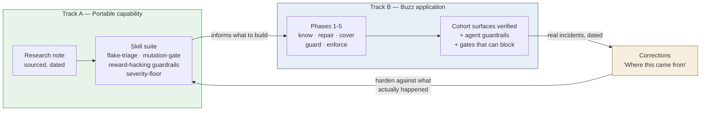
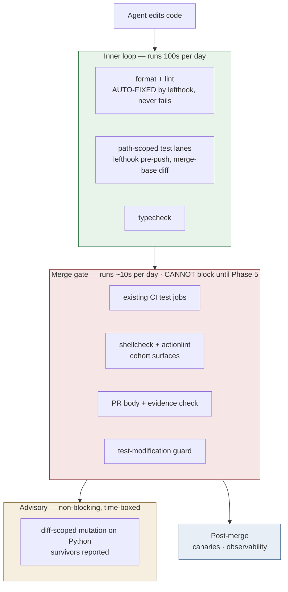
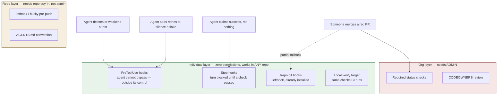
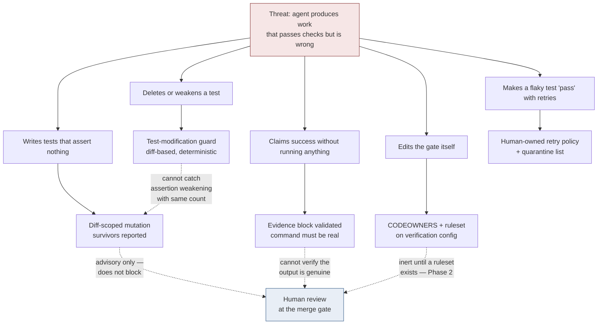
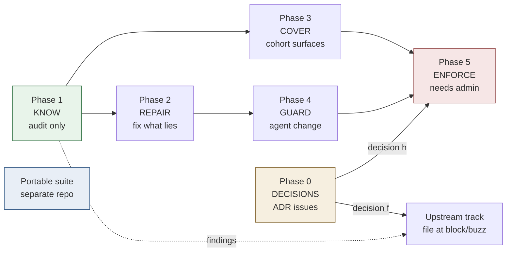

# Test Automation & Verification Programme

**Status:** planning · **Written:** 2026-09-03 · **Owner:** Serina
**Companion plan:** `launchpad/plans/2026-09-03-verification-hardening.md` (revision 3, review-gated twice)
**Research base:** `~/research/test-automation-for-agentic-coding.md` (sourced, primaries verified 2026-09-03)

> **Branch note.** This file and its companion plan are untracked and were written while
> `fix/1996-file-size-check-wrong-base` was checked out. They belong on their **own branch off
> `launchpad`**, not on that fix branch.

---

## Summary

### For a human

Buzz's checks feel broken. The evidence says something more specific, and more fixable:

1. **The code tests are mostly fine.** `ci.yml` failed 4 of its last 100 runs. All four were
   documentation-only PRs failing **Desktop browser tests** — a flake signature, not a code defect.
2. **The noise is in the process checks.** The PR body check failed 9 of 25 runs; the issue body
   check 5 of 7. A gate that is usually red teaches everyone to ignore red.
3. **No check can actually block a merge.** The fork has zero branch protection, zero rulesets and
   zero required status checks. Every red ✗ so far has been advisory. This is the single highest-value
   fix in the programme.
4. **The one CODEOWNERS entry is inert** — GitHub's own validator reports `Unknown owner` for
   `@block/buzz-oss-team` on this fork.
5. **Trivia should never fail a gate.** Formatting auto-fix already exists and works. What is missing
   is the *policy*: an agent that finds a typo fixes it in place; gates fail only for behaviour,
   security, or verification integrity.
6. **Two things are being built, not one.** A *portable skill suite* (works in any repo) and a
   *Buzz application* of it. They ship in separate phases; the Buzz work is what makes the skills
   real rather than theoretical.

**What this programme does not claim.** Not foolproof. Every layer here can miss something. The design
is layers whose blind spots do not overlap, plus failures that say what to do next. Where a layer
cannot catch something, this document names it.

### For an agent picking this up

```
ROLE            You are executing one phase of a multi-phase programme.
READ FIRST      the Phases section below                              ← reworked 2026-09-03
                ~/research/test-automation-for-agentic-coding.md      ← why each mechanism exists
                records/                                              ← what has already gone wrong
SUPERSEDED      launchpad/plans/2026-09-03-verification-hardening.md is HISTORY.
                Its 13 steps predate the Codex review. Do not build from it.
BUILD WITH      serina:build-change, from a Feature-level plan written per phase
GATES           review-plan before building · review-code + review-tests per step
                review-final before merge · qa explore mode applies
BLOCKED-ON      Phase 0 decisions are HUMAN decisions. Do not resolve them yourself.
                (h) admin access · (g) CODEOWNERS owners · (f) upstream posture.
FIRST RULE      Before prescribing any mechanism, SEARCH FOR IT. Three times in one
                session a plan proposed building something that already existed.
                Record where it exists, or that a named search found nothing.
NEVER           add retries, sleeps or timeout bumps to make a failing test pass
                weaken or delete a test without a `test-change:` declaration
                edit lefthook.yml, CODEOWNERS or workflows without human review
                set git core.hooksPath globally — it disables this repo's lefthook
ALWAYS          show command output as evidence, never assert success
                fix trivia in place; report only behaviour/security/verification defects
```

---

## Two tracks, one feedback loop

The most common way this programme could go wrong is treating it as one thing. It is two, and the
value flows in a specific direction: the skill suite does **not** depend on Buzz being fixed, but the
skills only become *good* by being tested against Buzz's real failures.



**Read the loop, not the boxes.** Skills written from research alone drift. Skills carrying a dated
incident stick — which is exactly how `plan-change` is written, with its own "Where this came from"
section. Track B is the incident generator for Track A.

---

## The verification ladder

The governing rule for efficiency: **the more often a check runs, the cheaper it must be.** Agents
iterate hundreds of times where a human iterates ten, so *where* a check sits matters more than which
tool implements it.



| Placement rule | Consequence when broken |
|---|---|
| Trivia is auto-fixed in the inner loop | Gates go red for formatting; red stops meaning anything |
| Only the merge gate blocks | Slow checks tax every agent iteration |
| Expensive checks are diff-scoped and advisory | Mutation runs blow the budget and get disabled wholesale |
| Flaky ≠ failed, as a distinct reported state | Agents "fix" flakes by adding retries, corrupting the suite |

---

## Enforcement layers — admin is the weakest link, not the strongest

**Design principle, decided 2026-09-03:** the individual layer is **primary**; repo and org
enforcement are **optional upgrades**, detected and used where available.

This came from asking the right question — *"there will be times you're working on someone else's
project and won't have admin, but you still want the skill"*. That is the common case, not the edge
case. A verification system that only works where you hold admin is a system you cannot take with you.

### Two threat models, often confused

| | Threat | Enforced by | Needs admin? |
|---|---|---|---|
| **Organisational** | *anyone* merges something bad | required status checks, CODEOWNERS review | ✅ yes |
| **Individual** | *my own agent* games my tests, or I push something broken | harness hooks, git hooks, local gates | ❌ **no** |

**The reward-hacking problem lives entirely in row two.** The research's documented failure modes —
agents deleting tests, adding retries to silence flakes, asserting success without running anything —
are all threats from *your own* agent. None of them need org-level permission to prevent.



Note what the diagram shows: **three of the four agent threats are fully covered without admin.** Only
"someone merges a red PR" genuinely requires org-level enforcement — and that is the one threat that
is not about agents at all.

### The ladder, strongest first

| # | Layer | Bypassable by | Portable to any repo? |
|---|---|---|---|
| 1 | **Claude Code PreToolUse hooks** | nothing the agent controls | ✅ |
| 2 | **Stop hooks** — block the turn until a check passes | nothing the agent controls | ✅ |
| 3 | **Repo git hooks** — lefthook pre-commit/pre-push | `--no-verify` (a deliberate act) | ⚠️ per-repo |
| 4 | **Local verify target** (`just verify`, Makefile) | not running it — so pair with 1 | ✅ |
| 5 | **Repo hooks** (`lefthook.yml`) | `--no-verify`; needs repo buy-in | ⚠️ per-repo |
| 6 | **Protection on your own fork** — you *are* admin of your fork | — | ⚠️ fork workflow only |
| 7 | **Upstream branch protection** | — | ❌ needs admin |

### This is already proven in-house

Serina's existing global hooks are a working instance of layers 1–2, predating this programme:

- **`verify-gate.sh`** — PreToolUse on Bash: blocks `git commit` unless a **fresh verification stamp**
  exists. The stamp is written by a passing test run and **cleared by any edit**, forcing
  re-verification. That is evidence-required completion, enforced where the agent cannot argue with it,
  in every repo she clones.
- **`git-safety.sh`** — blocks destructive git operations.
- **`pr-gate.sh`** — refuses `cd <dir> && gh pr create/merge` shapes.

Both files also carry their own dated defect notes — `verify-gate.sh`'s trigger was once
`git\s+commit\b`, which `git -C /path commit` walked straight past; a guard narrower than the thing it
guards. **That is the pattern to copy: the guard, and the written record of how it failed.**

**Do NOT reach for `git config --global core.hooksPath`.** It looked like unused headroom, and it is
a trap: git honours **one** hooks directory, so setting it globally redirects away from `.git/hooks`
where lefthook installs — silently disabling this repo's DCO, formatting and pre-push checks. Caught
by the Codex review before anyone tried it. A personal-hooks layer would need an explicit chaining
dispatcher, which nothing here has.

## Defence in depth — and the honest gaps

No single layer is sufficient. What makes this a system rather than a pile is that each layer's blind
spot is covered by a different layer. Where nothing covers it, this says so.



**Named blind spots** — these are design limits, not oversights:

| Layer | Cannot catch | Covered by |
|---|---|---|
| Test-modification guard | assertion *weakening* with unchanged count (`assert_eq!(a,a)`) | mutation layer (advisory) |
| Mutation testing | anything outside the diff; and it does not block | human review; periodic audit |
| Evidence block | pasted output that was never actually produced | human review; CI re-runs the same command |
| Flake quarantine | a genuine bug misfiled as a flake | every entry carries an issue number, so it stays visible |
| All of it | a wrong requirement correctly implemented | `qa` premortem; product review |

---

## Phases

**Reworked 2026-09-03 against the Codex review.** The previous seven-phase structure had a circular
dependency, aimed its expensive mechanisms at upstream product code the cohort does not author, and
prescribed several mechanisms that already existed. This version is smaller, ordered so nothing
depends on anything later, and aimed at surfaces the cohort owns.

**The governing change:** *know, then repair, then extend, then enforce.* The old plan started by
building mechanisms. Codex's recommendation was to establish stable statuses and repair the existing
fail-open paths first — that is now Phases 1 and 2, and they gate everything expensive.



Dependencies run one way only. Phases 1–4 need no cohort decision and no admin. Phase 5 is the only
one gated on access; Phase 6 is the only one gated on the charter.

---

### Phase 0 — Decisions, as ADR issues

**Four** decisions, not three — the earlier count was wrong. Each becomes an ADR issue parented to the
PRD, per `launchpad/AGENTS.md`: *"ADR is first on purpose: decisions masquerade as work."*

| # | Decision | Owner | Blocks |
|---|---|---|---|
| **(h)** | Does anyone in the cohort hold admin on the fork, and will they enable a ruleset? | **Jeff — `tucktuck101`** | Phase 5 |
| **(g)** | Who are the valid CODEOWNERS? The current owner is `Unknown owner` on this fork | **Group** | Phase 5; moot if (h) is no |
| **(f)** | Upstream posture: are upstream-surface findings filed at `block/buzz`, carried as fork divergence, or dropped? | **Group** | Phase 6 |
| **(e)** | *Folded into (f)* — the docs-only Desktop E2E path filter edits upstream `ci.yml`, so it inherits the same decision | — | — |

**Escalation rule.** If (f) is unanswered when Phase 4 completes, default to the narrowest reading —
file upstream, change nothing in the fork — record it with its date, and reopen later.

---

### Phase 1 — Know what is actually verified *(audit only, builds nothing)*

The phase that should have come first. Every prior review pass caught a claim asserted rather than
checked; this phase exists to replace assumption with evidence before any mechanism is designed.

| Task | Question it answers |
|---|---|
| **CI coverage audit of cohort tests** | 121 Python test files exist under `launchpad/`. Which are actually executed by a workflow? Spot checks show `launchpad/scripts` **is** covered (`launchpad-pr-check.yml:144`, `launchpad-adr-check.yml:63`), while several skill test directories have no workflow watching their path. Confirm per directory — do not assume |
| **Fail-open inventory** | Which existing checks pass when their input is missing? Two are already known: `pr_body_check.py` degrades to text search when the GitHub API is unavailable; the Playwright flaky summarizer skips silently. Find the rest |
| **Meta-check failure triage** | Why does the PR body check fail 9 runs in 25? Classify each: checker bug / agent non-conformance / template gap / nagging-by-design. Keep the failing bodies as a replay corpus |

**Exit:** a findings list, one record event per finding, and a replay corpus. **No mechanism built.**

---

### Phase 2 — Repair what lies *(in-charter, cohort-owned)*

Codex's own recommendation: repair the existing fail-open paths before adding new ones. A check that
passes when it did not check is worse than no check, because it is counted as coverage.

- Fix the dominant meta-check failure class from Phase 1
- Make each failure message name the violated rule and show a conforming example — agents iterating
  against vague failures is where retry-spam begins
- Decide `pr_body_check.py`'s degradation deliberately: either fail closed when the API is
  unavailable, or state in the output that it is advisory. It must not do both
- If Phase 1 shows the issue body check is nagging-by-design, stop treating it as a gate. It runs on
  issue events and can never be a required PR check regardless

**Exit:** body-check failure rate under 10% over a week; no check in the inventory passes on absent
input without saying so.

---

### Phase 3 — Cover the cohort's own surfaces *(in-charter — the Blocker-3 remedy)*

The cohort authors Python, shell, workflows and documentation. That is where verification belongs.

| Surface | Today | Add |
|---|---|---|
| 30 shell scripts under `launchpad/` | **no linting at all** — verified, `shellcheck` appears nowhere | shellcheck in CI and pre-commit |
| 10 `launchpad-*` workflows | **no linting at all** — `actionlint` appears nowhere | actionlint in CI |
| 121 Python test files | CI exists but is path-filtered per area | close the gaps Phase 1 found |
| `launchpad/scripts` logic | tests run; quality unmeasured | **mutation testing with `mutmut`, diff-scoped, advisory first** |

**Mutation belongs here, not on `crates/**`.** The old plan ran mutation against upstream Rust the
cohort does not write. Python under `launchpad/scripts` is where cohort logic actually lives — and
`test_pr_body_check.py` alone carries 82 tests whose strength nobody has measured.

**Exit:** shellcheck and actionlint green in CI; every cohort test directory is executed by some
workflow, or its absence is recorded as deliberate; a mutation baseline exists with an ADR
recommending gate / advisory / drop.

---

### Phase 4 — Guardrails on agent-authored change *(in-charter)*

- **Test-modification guard**, scoped to what the cohort owns first: `launchpad/**/test_*.py`,
  `launchpad/**/*.sh`, and the workflows. Widen later on evidence. The old plan named `crates/**`
  Rust and `.spec.ts` only, which missed ~500 Desktop, 156 Flutter, 100 Tauri and 121 cohort test
  files — including the tests for the very checker it modified
- **Evidence block**: fix the empty-fence bypass in the existing check. Per Codex, a validator that
  accepts a fabricated pass count is a formatting validator, not evidence — so either validate a
  **CI run reference** or state plainly that it is advisory. Do not claim more than it does
- **Severity floor policy** — trivia is fixed in place, never reported. Policy only; the lefthook
  auto-fix lanes already exist

**Stated blind spot:** the guard cannot detect assertion *weakening* with unchanged count. Phase 3's
mutation layer is what covers that, and it is advisory — so this is a real gap, not a covered one.

**Exit:** fixture diffs prove each guard fails without a declaration and passes with one; an
empty-fence body fails.

---

### Phase 5 — Make red able to block *(gated on decision (h) — needs admin)*

Nothing today can block a merge: no ruleset, no branch protection, no required status checks.

- Enable a ruleset on `launchpad` with **required status checks naming the checks built in Phases
  2–4**, plus required PRs
- Fix `.github/CODEOWNERS` — its sole owner is invalid on this fork, so every entry is inert — then
  extend it to the verification config
- Path guard for agent PRs touching verification config, fail-closed

**The circular dependency is gone.** The old step 7 depended on a quarantine file created in a
charter-blocked phase. Quarantine is dropped from this programme; the ruleset protects the files that
exist when it is enabled, and later additions extend the list.

> ⚠️ Enabling a ruleset on a busy branch mid-fleet can block in-flight agent PRs. Schedule it,
> announce it in the worklog, keep "disable ruleset" ready.

**Exit:** `gh api repos/launchpad-26/buzz/codeowners/errors` returns zero errors; a PR failing a
required check cannot be merged.

---

### Phase 6 — Upstream track *(gated on decision (f); not a blocker for anything else)*

Findings on upstream product surfaces. The fork's own guide is explicit: *"Genuine product bugs in
Buzz still belong at block/buzz/issues."*

| Finding | Action |
|---|---|
| **INC-0001** — `playwright.config.ts` declares no JSON reporter, so `summarize-flaky-tests.mjs` has never had input and exits green | File at `block/buzz`. Small, well-evidenced, fixes a monitoring failure |
| Desktop E2E flakes failing docs-only PRs | Propose path-filtering upstream — it would have prevented all four observed `ci.yml` failures |
| nextest profiles, retries, JUnit for `crates/**` | Propose upstream or drop. **Not carried in this fork** |

---

### Phase 7 — Portable suite *(Track A — separate repo, runs in parallel)*

Unchanged and largely untouched by the Codex review: the topic-named repo, the plugin shipping hooks
and skills, the `init` skill, the portability gate. It is not a Feature of this PRD — it lives in a
different repository.

One correction carried over: the enforcement claim must be stated honestly. Harness hooks are
**accident prevention within one harness**, not a security boundary. They do not govern other agents,
IDEs, browser edits or humans.

---

### Continuous — the finding record

Not a phase. Every phase writes findings to `records/`, and the pattern across them is what justifies
changing a skill later.

---

### Dropped, with reasons

Naming what was removed matters as much as what remains — a silently dropped mechanism reads as an
oversight later.

| Dropped | Why |
|---|---|
| Personal git hooks via `core.hooksPath` | Git honours **one** hooks directory; setting it globally redirects away from `.git/hooks` where lefthook installs, silently disabling DCO, formatting and pre-push checks |
| "Affected tests only" inner loop | The tools named do not exist here: `--lf` is last-failed not affected; Desktop uses Node's built-in runner so `--findRelatedTests` is unavailable; Flutter has no affected-test mechanism |
| `retries = 2` with exclusions | That is default-on retries, not scoped retries. New stateful or timing-sensitive tests would silently inherit them. If retries return, default 0 with human-owned opt-in |
| nextest JUnit at a fixed path | `ci.yml` invokes `cargo nextest run` many times; one configured path means later runs overwrite earlier reports and the artifact shows a fraction of the run as though it were the whole |
| Human-approval status check | Runs on `pull_request`, not `pull_request_review`, so an approval would never re-trigger it. Needs a different design if it returns |
| Quarantine file feeding both runners | Source of the circular dependency, and no evidence yet that quarantine is needed. Revisit when a flake actually needs quarantining |

---

## What happened to the old 13-step plan

`launchpad/plans/2026-09-03-verification-hardening.md` is **superseded history**, kept for the record
rather than for execution. It was written before the Codex review, and its structure did not survive
it: the step ordering was circular, and several steps aimed at surfaces the cohort does not author.

Where each old step went:

| Old step | Now |
|---|---|
| 1 — meta-check triage | **Phase 1**, widened into a full audit of what is actually verified |
| 2 — fix dominant failure class | **Phase 2** |
| 3, 4 — nextest profiles, `ci.yml` wiring | **Dropped** — upstream surface, and the fixed JUnit path collides across many nextest invocations |
| 5 — Playwright flaky surfacing | **Phase 6, upstream** — the machinery already exists and is fail-open (INC-0001); the fix belongs at `block/buzz` |
| 6 — quarantine file | **Dropped** — source of the circular dependency, and no evidence yet that quarantine is needed |
| 7 — ruleset + CODEOWNERS | **Phase 5**, decoupled from quarantine so nothing depends on a later phase |
| 8 — test-modification guard | **Phase 4**, re-scoped to cohort surfaces after the old scope was shown to miss most of the repo's tests |
| 9 — evidence check | **Phase 4**, with the honest limit stated: validate a CI run reference or stay advisory |
| 10, 11 — mutation on `crates/**` | **Phase 3**, re-aimed at Python under `launchpad/scripts` where cohort logic lives |
| 12 — severity floor | **Phase 4** |
| 13 — verification ladder docs | **Phase 2 and 4**, with the fictional inner-loop tooling removed |

**New in the rework, absent from the old plan:** Phase 1's audit, shellcheck for 30 unlinted shell
scripts, actionlint for 10 unlinted workflows, and a separate upstream track.

**No step-level plan currently exists for the reworked phases.** That is deliberate — each Feature
gets its own plan when its issue is created, rather than one monolithic document that drifts.

---

## Include / avoid / bloat

Carried from the research note, applied to this programme.

### ✅ Include

Fast deterministic tests with machine-readable output · scoped retries with flaky as a *distinct
state* · human-owned quarantine carrying issue numbers · diff-scoped mutation as test-quality signal ·
test-modification guards · evidence-required completion · severity routing so trivia never fails a
gate · required status checks that can actually block · property-based tests on core invariants.

### ⚠️ Avoid

Trusting a green suite the agent could have modified · coverage percentage as an acceptance criterion ·
agent-authored retries or timeout bumps · "AI test theatre" — AI code + AI tests + AI review with no
independent layer · gates that are usually red · blanket retries on tests sharing mutable state ·
mandating agent-performed TDD ritual as though it were settled (it is contested; test-*gating* is not).

### 🎈 Bloat

Standalone AI test-generation SaaS (Playwright ships planner/generator/healer free) · LLM eval
platforms in a code-testing suite · full-suite mutation per PR · contract-testing brokers introduced
fresh · custom test-result formats · unsupervised self-healing tests · new Selenium work.

---

## Future direction — a container as the distribution and boundary layer

**Not decided. Not scheduled.** Recorded 2026-09-03 so the option is not re-derived from
scratch later. When it comes up, it wants its own ADR: *distribution — container image vs copied
marketplace*.

Three things get called "put it in a container", and they are worth different amounts:

| Reading | Value here |
|---|---|
| CI runner image | **Low.** Hermit already pins this repo's toolchain; the reproducibility argument is spent |
| Devcontainer for Buzz | **Low–moderate.** Onboarding convenience, orthogonal to verification |
| **Verification / agent sandbox image** | **The interesting one** — everything below concerns this |

### Why it is worth taking seriously

**It is a real boundary where a hook is not.** The strongest criticism of the individual-layer
argument (Codex Blocker 2, accepted) was that Claude hooks do not govern Codex, other harnesses,
IDEs, browser edits or humans. A container does: it controls which binaries exist, can mount the
repo read-only, and can drop network. Anything running inside is subject to it, whatever launched
it.

That fills the gap in the enforcement ladder, which currently jumps from *"personal hooks,
bypassable"* straight to *"required checks, needs admin"*:

| Rung | Governs | Needs admin? |
|---|---|---|
| Personal hooks | one harness | no |
| **Container sandbox** | **anything running inside it** | **no** |
| Required status checks | the merge | yes |

**It also answers the supply-chain objection to the plugin** (Codex High #11: no signing, no
pinning, no provenance, no way to tell which copied generation someone runs). Container registries
have solved exactly that: immutable digests, cosign signatures, SBOMs, version tags, a patch
channel. `registry/verify@sha256:…` is more auditable than copied shell scripts, and it turns
"build your own so you own it" from a maintenance dodge into something with provenance.

### What it does not solve — state these before adopting

- **Organisational enforcement.** A container cannot block a merge. Required checks still need admin.
- **Self-modification.** If the agent can edit the Dockerfile or rebuild the image, it is not a
  boundary — the same hole as hooks. It holds **only if the image is built elsewhere and the agent
  runs inside it**.
- **Drift.** Moved, not removed. A stale image carries stale tools and open CVEs, and publishing one
  creates a patching obligation.
- **Toolchain pinning in this repo.** Hermit already does it.

### The trap

**Keep the container out of the inner loop.** The ladder's governing rule is that the cheapest
checks run most often; a container round-trip on every edit-test cycle makes the fastest loop slow,
and an agent will route around a slow loop. Host for the inner loop, container for the merge-gate
equivalent and for reproducing CI locally.

### Sequencing, if it happens

Skills and hooks first — they define *what* is enforced. Container later — it defines *where* it
runs and how it is distributed. Building the image first packages behaviour that has not been
validated yet.

This is a direction for the **portable suite** (Track A), not for the Buzz programme (Track B),
where Hermit and CI already cover what it would add.

## The finding record — where defects live after the session ends

**Established 2026-09-03.** Every review in this programme has produced findings that would
otherwise exist only in a chat log. The record is where they persist, queryable by a human or an
agent, with the timestamps and authorship a trend needs.

**Not a database — append-only JSONL plus prose, in git.** The decision and its reasoning:

| Requirement | JSONL + git | A database |
|---|---|---|
| When found, by whom | `ts` + `detected_by`, and git blame on every line | you maintain it yourself |
| When fixed, by whom | `resolved_ts`, and the committing author | you maintain it yourself |
| Agent can read it | grep, no client, no credentials | needs a tool and access |
| Reviewable in a PR | diffable | invisible |
| Survives the machine | it is in a repo | needs backup and ops |
| Setup cost | zero — `sre-incident-record` already exists | non-trivial |

The deciding argument is *found by who, when*: **git already answers that for every line,
permanently, without anyone remembering to type it.** A database would mean reimplementing version
control, worse.

### Where each record lives

**The record follows the thing it is about** — two records, not one:

| Record | Holds | Example |
|---|---|---|
| `buzz/records/` | defects in this repo's CI, gates and config | INC-0001 Playwright reporter gap · INC-0002 no required checks |
| `serina-skills/records/` | defects in *how the work is done* — the skills that plan and review | INC-0005 planning prescribes already-built work |

A finding about Buzz's pipeline belongs to Buzz. A finding about a planning skill belongs with the
skill, or the next repo inherits the same defect with no record of it.

### This does not conflict with the no-roadmap rule

`launchpad/AGENTS.md` states: *"Stable knowledge belongs in a document. Active work becomes a GitHub
issue"* and *"No `PLANNED.md`, no roadmap files."* The record is **stable knowledge** — what went
wrong and what changed — so it belongs in a document by that rule's own terms. The **roadmap** half
of this programme is what must become issues.

### Schema — what each event carries

`sre-incident-record`'s schema already covers what a finding log needs: `id` (`INC-0001`), `ts`
(when it *happened*, backfilling expected), `kind`, `summary` (≤100 chars), `tags` (`area/thing`),
`repo`, `detected_by` (`human`·`ci`·`agent`·`hook`·`audit`), `severity`, `resolved_ts` (absent means
open), `doc`, `refs`, `supersedes`.

**One gap:** there is no `resolved_by`. Either add the field, or read it from the author of the
commit that sets `resolved_ts` — preferred, because a field you must remember to fill goes stale.

**`detected_by` is the field that earns its keep.** `detected_by: human` on something a check should
have caught **is itself a finding**: it says the checks are not working. Of the events seeded today,
two are human-detected — the fail-open portability check and the unowned gate decisions. Both were
things a process should have caught.

### Seeded 2026-09-03

Six events in `buzz/records/`, six in `serina-skills/records/`, three prose documents. The dataset
exists from day one rather than starting empty.

```bash
# what is still open
<skill>/query.sh --kind incident --open
# how often a human caught what a check should have
<skill>/query.sh --stats
```

**Discipline, from the skill itself:** *"a record where most events are `note` is a diary, not a
dataset."* Record only what answers a future question.

## Review record

This programme is being held until all requested reviews return. Every review is logged here with
what it raised and what actually changed as a result — not just that it happened.

> ⚠️ **Attribution to confirm.** The 2026-09-03 external feedback below was relayed by Serina. It
> originated with **Ben**, and a Claude instance was also asked to assess it; the three numbered
> points as received may be Claude's assessment rather than Ben's own words. **Serina to correct the
> Reviewer column before this document is shared.** Recorded ambiguous rather than guessed.

| Date | Reviewer | Raised | Outcome |
|---|---|---|---|
| 2026-09-03 | `review-plan` pass 1 | 10 findings, incl. **blocker**: CODEOWNERS review-requirement unenforceable | All addressed in revision 2 |
| 2026-09-03 | `review-plan` pass 2 | 2 **blockers** — no required status checks exist at all; CODEOWNERS' only owner is invalid — plus revision 2 planning lefthook auto-fix that already existed | All addressed in revision 3 |
| 2026-09-03 | Ben ⬜ *(see attribution note)* | ① Phase 0 has no named owner or date, especially the fork-charter call — a relationship decision on someone else's repo, not a technical one ② this file is untracked on `fix/1996-…`, needs its own branch ③ the two "verify before building" flags should be closed *before* Phase 4/5, not after | ① **Open** — Owner/Decide-by columns added to Phase 0 with an escalation rule; owners still unassigned ② **Open** — branch move not yet done ③ **Closed** — both verified 2026-09-03, see Provenance; two new caveats found |
| ⬜ pending | | | |
| ⬜ pending | | | |

### Why ① was the sharpest finding

A decision with no owner is a **fail-open default**: whoever reaches it first interprets it, and
nobody notices a choice was made. That is the same defect class this programme exists to remove —
sitting unnoticed in the programme's own governing gate. It was invisible from inside the document,
which is precisely the argument for external review.

**Pattern worth keeping:** across three review passes, every one found something the author could not
see from inside the work — stale references, a sampling artifact, already-built infrastructure, and an
unowned gate. None were catchable by re-reading. This is the evidence base for the verification-ladder
argument the programme makes, generated before a line of code was written.

### Adding to this log

One row per review. Record what changed, not that it was received — a review whose outcome column
says "acknowledged" did not land.

## Provenance

| Claim class | How it was established |
|---|---|
| Buzz CI/failure numbers | `gh run list` per workflow, `gh api` for rulesets/protection/codeowners, 2026-09-03 |
| Existing config claims | Read directly: `lefthook.yml`, `Justfile`, `desktop/playwright.config.ts`, `ci.yml`, `.github/CODEOWNERS` |
| Tool versions / adoption | npm, PyPI, crates.io, GitHub APIs measured 2026-09-03 |
| Agent failure modes | METR 2025-06-05; Anthropic arXiv 2511.18397; EvilGenie Nov 2025 |
| Coverage theatre | arXiv 2606.18168 (80.2% weak oracles); arXiv 2506.02954 (100% coverage / 4% mutation) |
| Mutation as countermeasure | Meta engineering 2025-09-30; Atlassian ~2025 |
| Plan quality | `review-plan` × 2 passes, findings recorded in the hardening plan |

**Verified 2026-09-03, after Ben's review** — both prior "verify before building" flags are now closed:

| Was unverified | Result | Consequence |
|---|---|---|
| nextest 0.9.136 profile / override / JUnit / flaky support | **Confirmed** — 0.9.136 released 2026-05-17; `[[profile.ci.overrides]]` with `filter` + `retries`, `[profile.ci.junit]`, `<flakyFailure>` elements, `flaky-fail-status` since 0.9.131 | No pin bump needed for Phase 4 |
| `cargo mutants --in-diff` semantics | **Confirmed** — takes a **file path**; needs `git diff`'s `b/` prefix or none; non-Rust ignored | Phase 5 buildable as specified |
| — | **New caveat:** "The diff is only matched against the code under test, not the test code" | A test-only PR yields **no mutants**. Mutation can never be the sole quality signal for test-only diffs |
| — | **New caveat:** `report-skipped` needs 0.9.143; pin is 0.9.136 | Quarantined tests are invisible in JUnit unless the pin is bumped — decide in step 6 |

**Still unverified:** org-level rulesets on `launchpad-26` (needs `admin:org` scope); whether the issue
body check is nagging-by-design (Phase 2 step 1 answers this).
